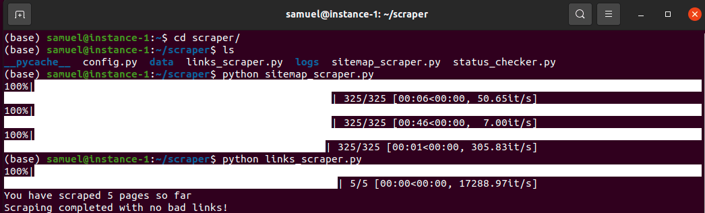

<div id="top"></div>


<h3 align="center">Wine Data Collection</h3>

<br />
<div align="center">
  <a href="https://github.com/SamuelAdamsMcGuire/wine_data_collection">
    
  </a>


  <p align="center">
    <br />
    <a href="https://github.com/SamuelAdamsMcGuire/wine_data_collection"><strong>Explore the docs »</strong></a>
    <br />
    <br />
    <a href="https://github.com/SamuelAdamsMcGuire/wine_data_collection">View Demo</a>
    ·
    <a href="https://github.com/SamuelAdamsMcGuire/wine_data_collection/issues">Report Bug</a>
    ·
    <a href="https://github.com/SamuelAdamsMcGuire/wine_data_collection/issues">Request Feature</a>
  </p>
</div>


<!-- TABLE OF CONTENTS -->
<details>
  <summary>Table of Contents</summary>
  <ol>
    <li>
      <a href="#about-the-project">About The Project</a>
      <ul>
        <li><a href="#built-with">Built With</a></li>
      </ul>
    </li>
    <li>
      <a href="#getting-started">Getting Started</a>
      <ul>
        <li><a href="#prerequisites">Prerequisites</a></li>
        <li><a href="#installation">Installation</a></li>
      </ul>
    </li>
    <li><a href="#usage">Usage</a></li>
    <li><a href="#roadmap">Roadmap</a></li>
    <li><a href="#contributing">Contributing</a></li>
    <li><a href="#license">License</a></li>
    <li><a href="#contact">Contact</a></li>
  </ol>
</details>


<!-- ABOUT THE PROJECT -->
## About The Project

The goal was to scrape over 320k wine reviews to be used in a recommender project. First the scraper package was developed [simplescraper](https://github.com/SamuelAdamsMcGuire/simplescraper). Due to the fact that there were so many links to scrape 4 servers were used. The servers were set up on `cloud.google.com`. 

`miniconda` and `samssimplescraper` were installed on each server. The data folder on each server was mounted to a single `cloud.google` storage bucket. All of the scarped html files were saved there. 

The scraped data will be cleaned and formated for use in a machine learning project which will soon be linked here. 

<p align="right">(<a href="#top">back to top</a>)</p>


### Built With

* [Python](https://www.python.org/)
* [samssimplescraper](https://github.com/SamuelAdamsMcGuire/simplescraper)

<p align="right">(<a href="#top">back to top</a>)</p>


<!-- GETTING STARTED -->
## Getting Started

Follow the installation instructions. The docstrings have detailed explainations for use. 

### Prerequisites

- Access to servers via googcloud, AWS or other means. If the scrape job is small it can be done from a home computer.
- Install `miniconda` or some sort of python support on the server(s).
- Install `gcsfuse` on server to mount the bucket for data storage.
- For large jobs a mounted storage of some sort would be recommended.
- To replicate the code here use [samssimplescraper](https://github.com/SamuelAdamsMcGuire/simplescraper)

### Installation

Once the server has python running then the code can be run with only the following package installed:

Install `pip` package
  ```shell
  pip install samssimplescraper==0.1.3
  ```
                
<p align="right">(<a href="#top">back to top</a>)</p>


<!-- USAGE EXAMPLES -->
## Usage

Code can be used as is for learning purposes. Or it can be adapted to user's goal and run in the server shell or locally. Follow the **Roadmap** and feel free to get in touch with any and all questions or comments. 

<p align="right">(<a href="#top">back to top</a>)</p>


<!-- ROADMAP -->
## Roadmap

1. Create server instance(s) and bucket on `googlecloud` or other provider.

2. Clone this repository on to the server:

```shell
git clone https://github.com/SamuelAdamsMcGuire/remote_data_collection
``` 

3. Create the following folder structure:

```shell
├── data
│   ├── pickled_lists
│   └── scraped_html
├── logs    
├── config.py
├── links_scraper.py
├── sitemap_scraper.py
└── status_checker.py
```
4. The `config.py` is only necessary if you wish to use **logging** to recieve an email. There is an example of the needed creditials in `config_example.py`. Some tweaks to your email settings may be necessary in order to recieve the emails. **Note:** Logs are also saved on the server.  

5. If a large amount of links are being scraped (here there are over 320k) then make sure to first mount the **data** folder to a bucket. On `googlecloud` first create the bucket and in the server shell mount using the following command:

```shell
gcsfuse example-bucket /path/to/mount
```

6. Adapt code to your project or replicate this one.

7. Scrape sitemap(s)

```shell
python sitemap_scraper.py
``` 

8. Scrape links. When running large scrape jobs it is also clever to run the process in the background:

```shell
nohup python links_scraper.py &
``` 

9. Check on progress using the status checker:

```shell
python status_checker.py
``` 

See the [open issues](https://github.com/SamuelAdamsMcGuire/wine_data_collection/issues) for a full list of proposed features (and known issues).

<p align="right">(<a href="#top">back to top</a>)</p>

<!-- CONTRIBUTING -->
## Contributing

Contributions are what make the open source community such an amazing place to learn, inspire, and create. Any contributions you make are **greatly appreciated**.

If you have a suggestion that would make this better, please fork the repo and create a pull request. You can also simply open an issue with the tag "enhancement".
Don't forget to give the project a star! Thanks again!

1. Fork the Project
2. Create your Feature Branch (`git checkout -b feature/AmazingFeature`)
3. Commit your Changes (`git commit -m 'Add some AmazingFeature'`)
4. Push to the Branch (`git push origin feature/AmazingFeature`)
5. Open a Pull Request

<p align="right">(<a href="#top">back to top</a>)</p>


<!-- LICENSE -->
## License

Distributed under the MIT License. See `LICENSE` for more information.

<p align="right">(<a href="#top">back to top</a>)</p>


<!-- CONTACT -->
## Contact

Samuel Adams McGuire - samuelmcguire@engineer.com

Linkedin: [LinkedIn](https://www.linkedin.com/in/samuel-mcguire/)

Project Link: [https://github.com/SamuelAdamsMcGuire/wine_data_collection](https://github.com/SamuelAdamsMcGuire/wine_data_collection)

Pypi Link for samssimplescraper: [https://pypi.org/project/samssimplescraper/0.1.3/](https://pypi.org/project/samssimplescraper/0.1.3/)

<p align="right">(<a href="#top">back to top</a>)</p>
